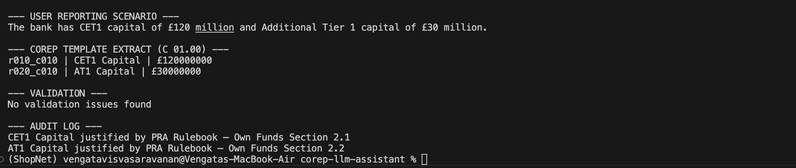

# LLM-Assisted PRA COREP Reporting Assistant (Prototype)

## 1. Problem Statement

UK banks regulated under the PRA Rulebook are required to submit COREP regulatory returns. These returns must strictly follow EBA COREP templates and instructions. Preparing COREP reports is labour-intensive because analysts must interpret dense regulatory text and manually map it to structured reporting fields, which increases the risk of errors.

This project implements a prototype of an LLM-assisted regulatory reporting assistant that demonstrates how an AI system can support analysts by interpreting regulatory rules, generating structured outputs, and providing traceable justifications for reported values.

---

## 2. Scope of the Prototype

The prototype is intentionally limited in scope to keep it safe, auditable, and easy to validate.

- COREP Template: C 01.00 (Own Funds)
- Fields Covered:
  - Common Equity Tier 1 (CET1)
  - Additional Tier 1 (AT1)

The Own Funds template was chosen because it has clear regulatory definitions and a direct mapping to COREP rows, making it ideal for demonstrating LLM-assisted regulatory interpretation.

---

## 3. What the Prototype Demonstrates

The prototype demonstrates the following end-to-end behaviour:

1. Accepts a natural-language description of a reporting scenario
2. Retrieves relevant regulatory instructions for Own Funds reporting
3. Uses an LLM to generate structured output aligned to a predefined schema
4. Maps the output to a human-readable COREP template extract
5. Applies basic validation rules
6. Produces an audit log showing which regulatory instructions justify each field

This directly aligns with the success criteria defined in the assignment.

---

## 4. High-Level Architecture

User Scenario (Plain English)
→ Regulatory Text Retrieval (PRA / EBA Instructions)
→ LLM (Gemini 2.5 Flash, JSON-constrained)
→ Structured JSON Output
→ COREP Schema Mapping
→ Validation
→ COREP Template Extract + Audit Log

---

## 5. Example Workflow

### Input (User Scenario)

The bank has CET1 capital of £120 million and Additional Tier 1 capital of £30 million.

---

### Structured LLM Output (JSON)

{
  "CET1 Capital": {
    "value": 120000000,
    "rule": "EBA COREP Instructions – Template C 01.00: Row 010"
  },
  "AT1 Capital": {
    "value": 30000000,
    "rule": "EBA COREP Instructions – Template C 01.00: Row 020"
  }
}

---

### COREP Template Extract (Human-Readable)

COREP Code: r010_c010  
Description: CET1 Capital  
Value: £120,000,000  

COREP Code: r020_c010  
Description: AT1 Capital  
Value: £30,000,000  

---

### Audit Log

- CET1 Capital is justified by EBA COREP Instructions – Template C 01.00, Row 010
- AT1 Capital is justified by EBA COREP Instructions – Template C 01.00, Row 020

---

## 6. Validation

The prototype includes basic validation checks, such as:
- CET1 capital must be a positive value

Any validation issues are explicitly flagged in the output.

---

## 7. Technology Stack

- Programming Language: Python 3.9+
- LLM: Gemini 2.5 Flash (Google AI Studio Free Tier)
- LLM Safety Measures:
  - Regulatory text grounding
  - Strict JSON schema enforcement
  - Markdown-safe JSON parsing
- Architecture Style: Modular and LLM-agnostic

---

## 8. Project Structure

corep-llm-assistant/
├── app.py
├── schema.py
├── rules/
│   └── own_funds_rules.txt
├── requirements.txt
├── .env.example
└── README.md

---

## 9. How to Run the Prototype

1. Install dependencies:
   pip install -r requirements.txt

2. Create a .env file:
   GEMINI_API_KEY=your_api_key_here

3. Run the application:
   python app.py

---

## 10. Limitations and Future Work

This is a prototype designed to demonstrate feasibility. Future improvements could include:
- Support for additional COREP templates
- More advanced validation and cross-field checks
- Automated ingestion of regulatory documents
- A user interface instead of console output

---

## 11. Summary

This prototype demonstrates how an LLM can assist regulatory reporting by translating natural-language scenarios into structured COREP-aligned outputs with full traceability. It shows how AI can reduce manual effort, improve consistency, and increase auditability in regulatory reporting workflows.

## Output of prototype

